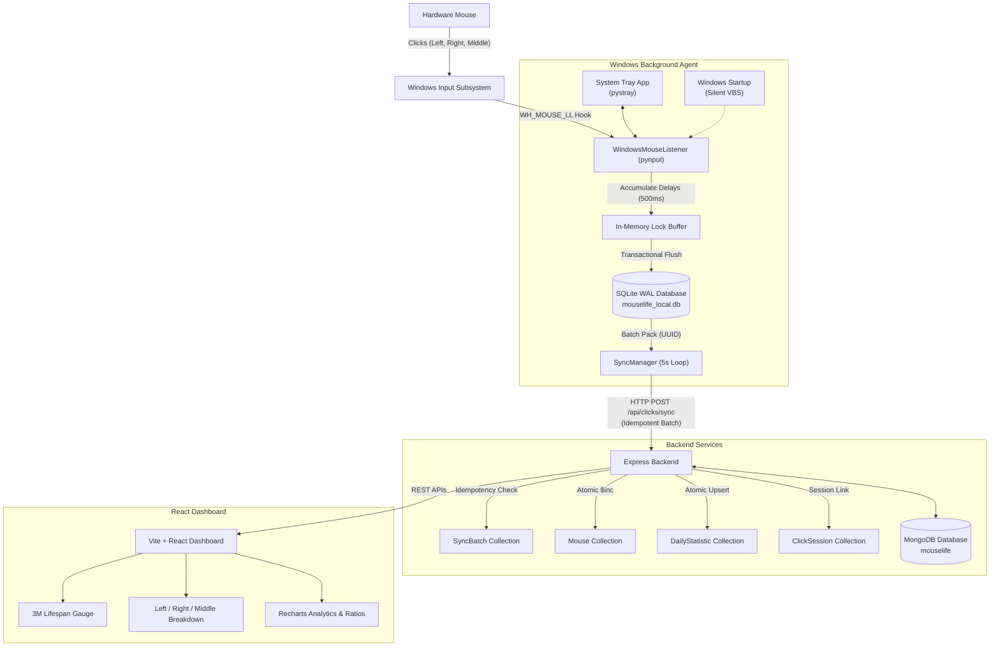

# MouseLife Tracker — Architecture & Technical Design

## 1. System Overview

**MouseLife Tracker** is an enterprise-grade mouse switch lifespan monitor and global click tracking application engineered for Windows. It answers the fundamental question:
> *"How many clicks has my mouse made since I started tracking it, and how much of its rated click lifespan have I used?"*

Target initial device: **Portronics Wireless Mouse rated for 3,000,000 clicks**.

---

## 2. Core Architectural Pillars

### 2.1 Low-Level Windows Input Hook
- **Hook Technique**: `SetWindowsHookExW` with `WH_MOUSE_LL` (id 14) running in an independent background thread.
- **Desktop Binding**: Automatically calls `OpenInputDesktop(0, False, 0x01FF)` and `SetThreadDesktop()` ensuring the hook thread binds directly to `WinSta0\Default` across interactive, startup, and background executions.
- **Strict Privacy Compliance**: Only processes `pressed=True` events for `Button.left`, `Button.right`, and `Button.middle`. Strictly zero tracking of cursor coordinates (X/Y), keyboard keystrokes, clipboard content, URLs, or screen contents.

### 2.2 Crash-Proof Local Persistence (SQLite WAL)
- Uses SQLite with Write-Ahead Logging (`PRAGMA journal_mode=WAL; PRAGMA synchronous=NORMAL;`).
- Stores pending clicks in `pending_clicks` and cached totals in `lifetime_stats`.
- If the computer reboots, shuts down, or loses internet connectivity, unsynchronized clicks remain safely stored locally.

### 2.3 Idempotent Batch Synchronization Protocol
- To eliminate excessive network overhead, clicks are never synced individually.
- The `SyncManager` aggregates clicks into periodic batches (default every 5 seconds).
- Each batch is assigned a cryptographically unique `batchId` (UUIDv4).
- The Express backend checks `SyncBatch` collection before incrementing counters. If the batch was already processed, it acknowledges the request without re-incrementing totals, completely eliminating double counting.

### 2.4 MongoDB Data Modeling & Atomic Operations
- **`Mouse`**: Stores hardware metadata, rated clicks (default 3,000,000), lifetime total/left/right/middle clicks, and virtual properties for `remainingClicks` (`max(rated - total, 0)`) and `lifeUsedPercentage`.
- **`DailyStatistic`**: Stores daily click volume by calendar date (`YYYY-MM-DD`) with a compound unique index on `{ mouseId: 1, date: 1 }`. Uses `$inc` with `upsert: true` for concurrency safety.
- **`ClickSession`**: Tracks duration and click breakdown per continuous work session.
- **`SyncBatch`**: Audit ledger ensuring exact-once synchronization semantics.

### 2.5 Windows Startup & System Tray
- **Startup Integration**: Generates a silent `.vbs` launcher in `%APPDATA%\Microsoft\Windows\Start Menu\Programs\Startup\MouseLifeTracker.vbs` running `pythonw.exe` without flashing console windows or needing administrator elevation.
- **System Tray**: Provides real-time click tally, live status indicator, Pause/Resume toggle, Open Dashboard shortcut, and clean exit handling.
